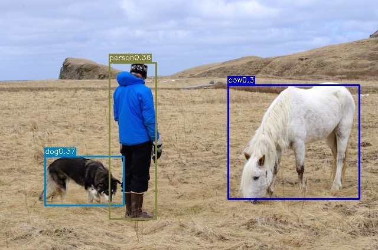
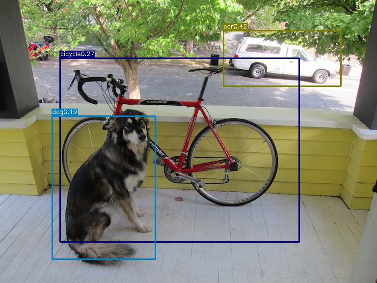
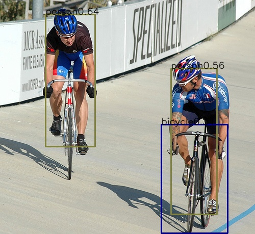
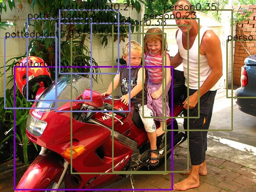
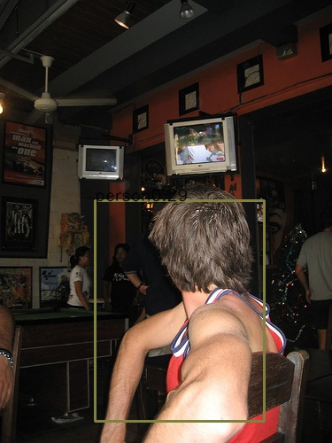
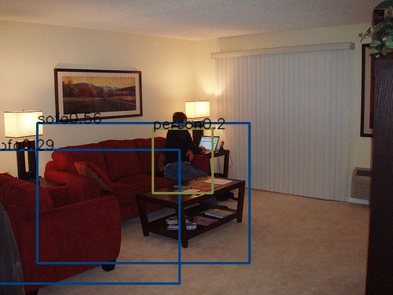
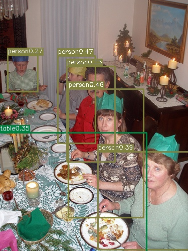

## pytorch YOLO-v1

[中文](中文.md) [博客](https://www.cnblogs.com/xiongzihua/p/9315183.html) 

**This is a experimental repository, which are not exactly the same as the original [paper](https://arxiv.org/pdf/1506.02640.pdf), our performance on voc07test is 0.665 map, 57fps@1080ti**

I write this code for the purpose of learning. In yoloLoss.py, i write forward only, with autograd mechanism, backward will be done automatically.

For the convenience of using pytorch pretrained model, our backbone network is resnet50, add an extra block to increase the receptive field, in addition, we drop Fully connected layer.

Effciency has not been optimized. It may be faster... I don't know 

## Train on voc2012+2007
| model                | backbone | map@voc2007test  | FPS  |
| -------------------- | -------------- | ---------- | -------   |
| our ResNet_YOLO  |   ResNet50        | 66.5%      |  57   |
| YOLO  |   darknet19?        | 63.4%      |  45   |
| YOLO VGG-16  |   VGG-16        | 66.4%      |  21   |

### 1. Dependency
- pytorch 0.2.0_2
- opencv
- visdom
- tqdm

### 2. Prepare

1. Download voc2012train dataset
2. Download voc2007test dataset
3. put all images in one folder, i have provide txt annotation file 
~~3. Convert xml annotations to txt file, for the purpose of using dataset.py, you should put the xml_2_txt.py in the same folder of voc dataset, or change *Annotations* path in xml_2_txt.py~~ 

### 3. Train
Run python train.py

*Be careful:* 1. change the image file path 2. I recommend you install [visdom](https://github.com/facebookresearch/visdom) and run it

### 4. Evaluation
Run python eval_voc.py

*be careful* 1. change the image file path

### 5. result

Our map in voc2007 test set is 0.665~ some result are below, you can see more in testimg folder.

